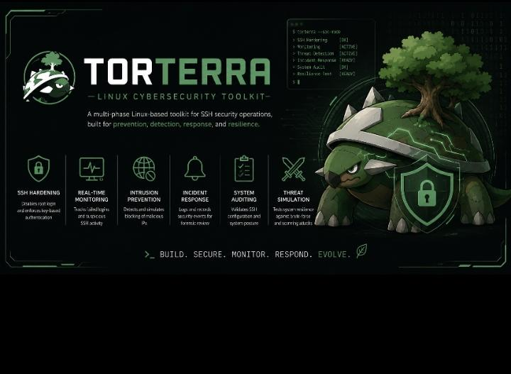

🛡️ Torterra – SSH Hardening & Security Toolkit

---
📖 Overview

Torterra is a comprehensive cybersecurity toolkit designed to demonstrate layered defense strategies for securing SSH environments in Linux systems.

It simulates and implements real-world security operations including:

🔐 System hardening (preventive security)
📡 Real-time monitoring (detective security)
🛡️ Intrusion prevention (defensive security)
🚨 Incident response (reactive security)
📊 Continuous auditing (validation & compliance)
⚔️ Threat simulation (resilience testing)

Unlike standalone scripts, Torterra is structured as a multi-phase security ecosystem, mirroring real SOC (Security Operations Center) workflows.

It also includes a terminal-based dashboard, turning raw security scripts into an interactive control center.

---
🚀 Key Features (Phase-Based Design)
🔹 Phase 1 – SSH Hardening (Preventive Security)
Disable root login (dis_root.sh)
Enforce SSH key-based authentication (key_setup.sh)
Secure SSH configuration baseline

🔹 Phase 2 – Real-Time Monitoring (Detective Security)
Monitor SSH login attempts (monitor_logins.sh)
Detect:
Invalid users
Failed password attempts
Authentication failures
Generate live alerts for suspicious activity

🔹 Phase 3 – Intrusion Prevention (Defensive Security)
Block malicious IP addresses (intrusion_prevention.sh)
Brute-force detection logic
Fail2Ban-style mitigation system

🔹 Phase 4 – Incident Response & Recovery
Log security incidents to:
/var/log/ssh_incidents.log
Structured incident documentation
Supports post-attack forensic analysis

🔹 Phase 5 – Continuous Monitoring & Auditing
SSH configuration auditing (rep_audit.sh)
System health validation
Security compliance checks

🔹 Phase 6 – Threat Simulation & Resilience Testing
Brute-force attack simulation (thrt_simulation.sh)
Port scanning and enumeration tests
SSH hardening validation checks
System resilience verification under attack conditions
📊 Torterra Dashboard (SOC Interface)

Torterra includes a terminal-based security dashboard (dashboard.sh) that acts as a central SOC control panel.

---
🧠 Features:
ASCII-based SOC banner interface
Interactive menu system
System status overview
Real-time monitoring integration
Quick access to all security modules

---
🖥️ Dashboard Capabilities:
System hardening control
Log monitoring activation
Intrusion prevention execution
Threat simulation execution
Incident response access

---
📂 Project Structure
Torterra/
├── configs/                    # SSH configuration files
│   └── sshd_config
│
├── docs/                       # Phase-wise documentation
│   ├── monitoring_guide.md
│   ├── prevention.md
│   ├── security_principles.md
│   └── intrusion/
│
├── scripts/                    # Core automation scripts
│   ├── dashboard.sh
│   ├── dis_root.sh
│   ├── incident_response.sh
│   ├── intrusion_prevention.sh
│   ├── key_setup.sh
│   ├── monitor_logins.sh
│   ├── rep_audit.sh
│   └── thrt_simulation.sh
│
├── tests/                      # Validation & test scenarios
│   └── test_cases.md
│
└── README.md

---
⚙️ Installation
git clone https://github.com/PranjalShridhar316/Torterra.git
cd Torterra/scripts
chmod +x *.sh
▶️ Usage
🔐 Run SSH Hardening
sudo ./dis_root.sh
sudo ./key_setup.sh

📡 Start Monitoring
./monitor_logins.sh

🛡️ Enable Intrusion Prevention
sudo ./intrusion_prevention.sh

⚔️ Run Threat Simulation
./thrt_simulation.sh

📊 Launch Dashboard
./torterra.sh

---
*Banner design by Ashita Dhiman*
Thank you so much, Ashita, for helping me with the banner design. It really makes my project look polished and professional, and I truly appreciate your creativity and support.

---
🖥️ Dashboard UI

████████╗  ██████╗    ██████╗  ████████╗ ███████╗ ██████╗  ██████╗   █████╗ 
╚══██╔══╝ ██╔═══ ██╗  ██╔══██╗ ╚══██╔══╝ ██╔════╝ ██╔══██╗ ██╔══██╗ ██╔══██╗
   ██║   ██║      ██║ ██████╔╝    ██║    █████╗   ██████╔╝ ██████╔╝ ███████║
   ██║    ██║    ██║  ██╔══██╗    ██║    ██╔══╝   ██╔══██╗ ██╔══██╗ ██╔══██║
   ██║    ╚██████╔╝   ██║  ██║    ██║    ███████╗ ██║  ██║ ██║  ██║ ██║  ██║
   ╚═╝     ╚═════╝    ╚═╝  ╚═╝    ╚═╝    ╚══════╝ ╚═╝  ╚═╝ ╚═╝  ╚═╝ ╚═╝  ╚═╝

        🌿 TORTERRA SOC SECURITY AGENT
        🧠 "Set once. Run forever."

User : 
Label:

1) Simulation Mode
2) Infinite SOC Mode
3) Reset Credentials
4) Exit

Select option: 

---
👨‍💻 Author
Pranjal Shridhar Verma  
Cybersecurity student 
Focused on system security, automation, and applied cybersecurity projects.

---
🤝 Contributing
Contributions, issues, and feature requests are welcome.
Please open an issue or submit a pull request to collaborate.

